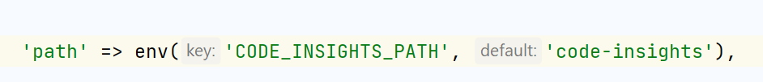

<link rel="stylesheet" href="https://cdnjs.cloudflare.com/ajax/libs/font-awesome/5.15.3/css/all.min.css">
<link rel="stylesheet" type="text/css" href="https://cdn.example.com/font/font.css">
<h1 align="center" style="font-family: 'CustomFont';"><u>Laravel Code Insights</u></h1>

## <p style="font-family: 'CustomFont';">_About_</p>
<br>


- <p style="font-family: 'CustomFont';">This package serves as a code insight for Laravel applications.</p> 
- <p style="font-family: 'CustomFont';">It presents a comprehensive list of controllers, repositories, models, traits, and helpers, allowing you to easily explore and access them. When selecting a controller, it displays its functions and corresponding source code. It also includes an optimization feature.</p>

## <p style="font-family: 'CustomFont';"><i class="fas fa-cog"></i> _Installation & Usage_</p>
<br>
<p style="font-family: 'CustomFont';">Requires <a href="https://php.net/releases/">[PHP 8.0+]</a> | <a href="https://laravel.com/docs/8.x"> [Laravel 8.0+]</a></p>
<p style="font-family: 'CustomFont';">Require Laravel DB Auditor  using : <a href="https://getcomposer.org">[Composer]</a></p>

```bash
composer require --dev vcian/laravel-code-insights
```
## <p style="font-family: 'CustomFont';">_Usage_</p>
<br>
<p style="font-family: 'CustomFont';">You can access Code Insights view via below route</p>
<p style="font-family: 'CustomFont';"><b>Access Route:</b> <a href="#"> http://yourdomain.com/code-insights</a></p>
<br>

<p style="font-family: 'CustomFont';"><b>Note:</b></p>
<p style="font-family: 'CustomFont';"> 1) Don't forget to replace your actual domain with "yourdomain.com"</p>
<p style="font-family: 'CustomFont';"> 2) You can also update your custom route with config/data-brigin.php</p>



## <p style="font-family: 'CustomFont';">_Changelog_</p>


> <p style="font-family: 'CustomFont';">Please see <a href="CHANGELOG.md"> [CHANGELOG]</a> for more information what has changed recently.</p>

## <p style="font-family: 'CustomFont';">_Contributing_</p>


<p style="font-family: 'CustomFont';">Please see <a href="CONTRIBUTING.md"> [CONTRIBUTING]</a> for details.</p>
<p style="font-family: 'CustomFont';">

       We believe in 
            👇
          ACT NOW
      PERFECT IT LATER
    CORRECT IT ON THE WAY.
</p>

## <p style="font-family: 'CustomFont';">_Security_</p>

<p style="font-family: 'CustomFont';">If you discover any security-related issues, please email ruchit.patel@viitor.cloud instead of using the issue tracker.</p>

## <p style="font-family: 'CustomFont';">_Credits_</p>

- [All Contributors](../../contributors)

## <p style="font-family: 'CustomFont';">_License_</p>

<p style="font-family: 'CustomFont';">The MIT License (MIT). Please see <a href="LICENSE.md"> [License File]</a> for more information.</p>
